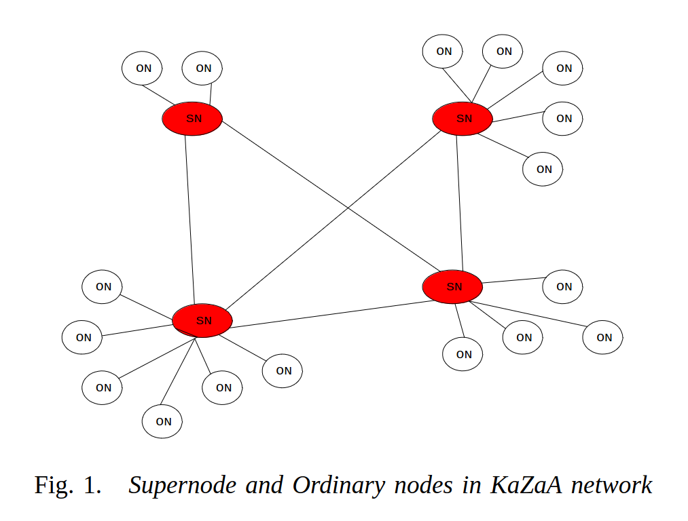

[](https://github.com/alyokaz/AKTorrent/actions/workflows/gradle.yml)

# AKP2P

AKP2P is an unstructured (technically hybrid), pure Java, peer-to-peer file sharing application. 
You can use AKP2P to download and share files with anyone else on the AKP2P network.

## Get Started

AKP2P can be built from source or run in a Docker container.

### Build From Source
Clone the repo and then build and run the jar from the project root. An optional address of a Beacon node can be 
supplied.

```
gradle build

java -jar /build/libs/AKP2P.jar [-beacon | -beacon-address <hostname> <port>]
```

### Run in a Docker Container
The port for AKP2P must be published when run in a container. `<port>` defaults to 4444 inside the container, 
but can be overridden.
```
docker pull alyoshakaz/akp2p
docker run -it -p <hostport>:<port> -p <hostport>:<port>/udp akp2p [-port <port>] [-beacon | -beacon-address <hostname> <port>]
```

An AKP2P node can be started in two modes <b>Beacon</b> and <b>Standard.</b> A Beacon node exists purely
for other nodes to register with and download the addresses of other nodes who have also registered.

## Notes on Design

The project was built with a purposeful <i>naive</i> design, eschewing any know protocols or architecture. This was done firstly as the impetus for the project was
exploratory and, secondly, to try to avoid a "Solutions looking for problems" mindset when building the code.
<p>
That being said, in a post-hoc analysis, it appears the protocol and architecture that emerged was something similar to 
that of the FastTrack protocol used by the networks such as Kazaa. 
<p>


Essentially the <i>standard</i> nodes in the AKP2P network are the equivalent of 
<a href="https://cse.engineering.nyu.edu/~ross/papers/UnderstandingKaZaA.pdf">Kazaa</a> <i>Supernodes</i> 
sharing a central directory of files and peers available on the network. That is we have a network of 
supernodes without any ordinary nodes existing.
<p>
It could be interesting to lean into this architecture in a future iteration, creating something analogous 
to Bitcoin's <a href="https://en.bitcoin.it/wiki/Full_node">full</a> and 
<a href="https://en.bitcoin.it/wiki/Lightweight_node">lite</a> nodes, giving a node owner a choice in 
their relationship to the network. 
<p>
The concept of file <i>Pieces</i> and that of a Beacon node, for registering network node addresses, seems to 
be something a kin to a primitive form of the Bitcoin protocol.
<p>
Consensus problems are dealt with by not requiring any consensus.
